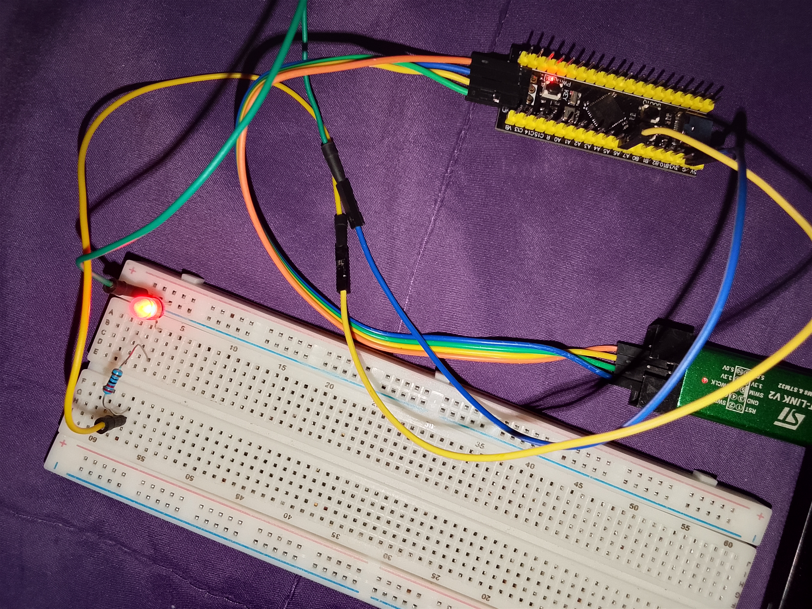

# Task Execution Deadline Monitor Using STM32F401CCU6

## Overview

This project measures the execution time of a task using the SysTick timer and checks whether it completes within a predefined deadline. An LED indicates if the task meets or exceeds the specified execution time limit.

## What I Learned

* Configuring SysTick as a timing source.
* Measuring task execution time.
* Calculating execution time using the SysTick counter.
* Implementing deadline-based task monitoring.
* Using GPIO to indicate task status.

## Project code
[Click here to check out the project code](code)

## Project Image

## Components Used

* STM32F401CCU6 Black Pill
* LED
* 220 Ω Resistor

## Outcome

Successfully monitored task execution time and verified whether it met the defined deadline, with the LED providing a visual indication of the result.

## Project Demonstration video
[Click here to check out the project Demo Video](https://youtube.com/shorts/18QPmHcDuOM)
